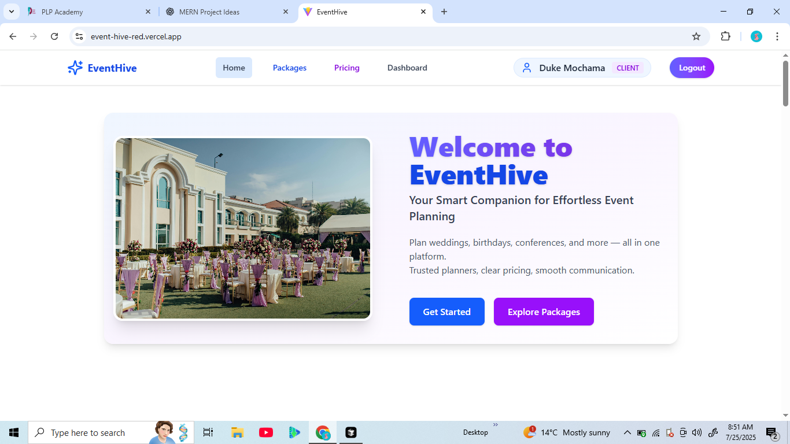
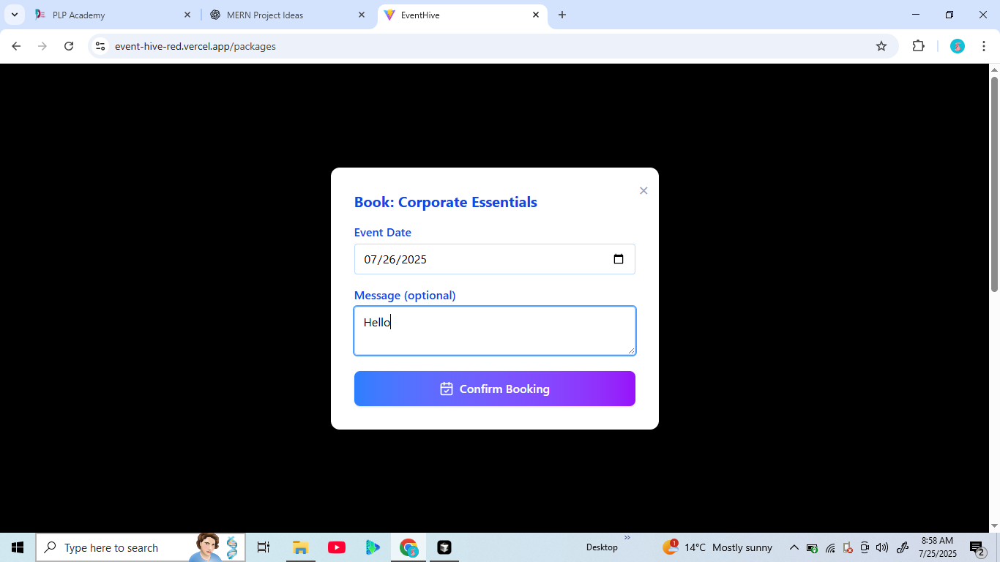
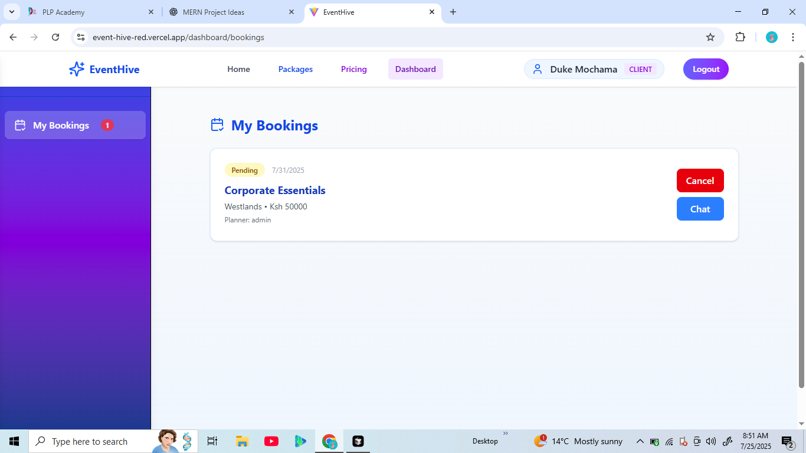
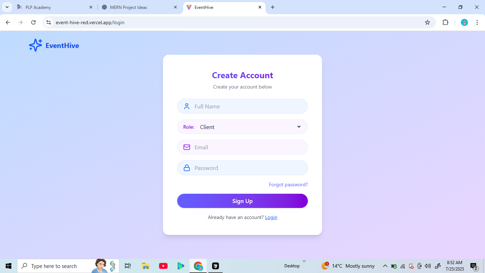

# EventHive


EventHive is a modern web application designed to streamline event management for clients, planners, and administrators. Built with a React frontend and an Express/MongoDB backend, EventHive provides a secure and user-friendly platform for organizing and attending events. The platform supports real-time bookings, in-app messaging, planner dashboards, and more, making event planning seamless for all users.

---

## 🚀 Live Demo

[Deployed Application](https://event-hive-red.vercel.app/)

## 🎥 Video Demonstration

[Watch a 5-10 minute demo (update with your video link)](https://your-demo-video-link.com)

---

## 🖼️ Screenshots

Below are some screenshots showcasing key features of EventHive:

| Home Page                               | Booking Page                               | Planner Dashboard                            |
| --------------------------------------- | ------------------------------------------ | -------------------------------------------- |
|  |  |  |   |

---

## ✨ Features

- **User Authentication:** Secure registration and login with JWT-based authentication.
- **Role Management:** Supports multiple user roles: client, planner, and admin.
- **User Dashboard:** Personalized dashboard for each user role.
- **Responsive UI:** Built with React, Tailwind CSS, and Vite for fast, modern user experiences.
- **API Integration:** RESTful backend with Express and MongoDB for data storage.
- **Reusable Components:** Modular React components for navigation, protected routes, and more.
- **State Management:** Context API for global authentication state.
- **Notifications:** Toast notifications for user feedback.

> **Note:** Event management features (such as event creation, RSVP, ticketing) are not yet implemented in the current codebase.

## 🛠️ Our Services

- 📦 **Event Package Listings** – Browse and compare planner packages by category and budget.
- 📆 **Real-Time Booking System** – Book planners based on availability and event type.
- 💬 **Secure In-App Messaging** – Communicate directly with planners and stay updated.
- 📁 **File/Image Sharing** – Upload mood boards, inspiration photos, and documents.
- 📊 **Dashboard for Planners** – Manage bookings, payments, and packages from a single interface.
- 💸 **Payment Integration** – Pay securely via M-Pesa or Stripe.

---

## 🧑‍💻 Technologies Used

### Frontend

- [React 19](https://react.dev/)
- [Vite](https://vitejs.dev/)
- [Tailwind CSS](https://tailwindcss.com/)
- [React Router DOM](https://reactrouter.com/)
- [Axios](https://axios-http.com/)
- [React Toastify](https://fkhadra.github.io/react-toastify/)

### Backend

- [Node.js](https://nodejs.org/)
- [Express 5](https://expressjs.com/)
- [MongoDB & Mongoose](https://mongoosejs.com/)
- [JWT (jsonwebtoken)](https://github.com/auth0/node-jsonwebtoken)
- [bcryptjs](https://github.com/dcodeIO/bcrypt.js)
- [dotenv](https://github.com/motdotla/dotenv)
- [CORS](https://github.com/expressjs/cors)
- [cookie-parser](https://github.com/expressjs/cookie-parser)

---

## ⚡ Getting Started

### Prerequisites

- Node.js (v18+ recommended)
- pnpm (or npm/yarn)
- MongoDB instance (local or cloud)

### Installation

#### 1. Clone the repository

```bash
git clone https://github.com/yourusername/EventHive.git
cd EventHive
```

#### 2. Setup the backend

```bash
cd backend
pnpm install
# or npm install
cp .env.example .env  # Edit with your MongoDB URI and JWT secret
pnpm run dev
```

#### 3. Setup the frontend

```bash
cd ../frontend
pnpm install
# or npm install
pnpm run dev
```

#### 4. Access the app

- Frontend: [http://localhost:5173](http://localhost:5173)
- Backend API: [http://localhost:5000](http://localhost:5000) (default)

---

## 📁 Project Structure

```
EventHive/
  backend/
    controllers/
    models/
    routes/
    index.js
    package.json
  frontend/
    src/
      components/
      context/
      pages/
      App.jsx
      main.jsx
    package.json
  README.md
```

---

## 🤝 Contributing

Contributions are welcome! Please fork the repository and submit a pull request.

## 📜 License

This project is licensed under the MIT License.

## 📬 Contact

For questions or support, please open an issue or contact the maintainer.
