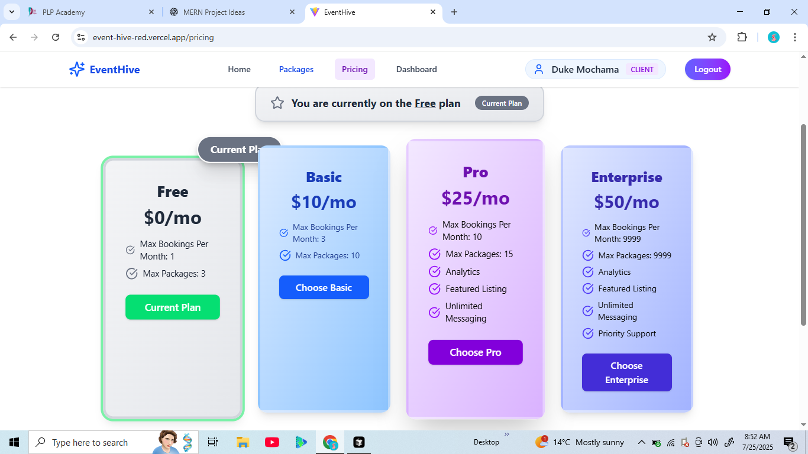

# EventHive

EventHive is a modern web application designed to streamline event management for clients, planners, and administrators. Built with a React frontend and an Express/MongoDB backend, EventHive provides a secure and user-friendly platform for organizing and attending events. The platform supports real-time bookings, in-app messaging, planner dashboards, and more, making event planning seamless for all users.

---

## 🚀 Live Demo

[Deployed Application](https://event-hive-red.vercel.app/)

## 🎥 Video Demonstration

[Watch a 5-10 minute demo (update with your video link)](https://your-demo-video-link.com)

---

## 🖼️ Screenshots

Below are some screenshots showcasing key features of EventHive:

| Home Page                                 | Booking Page                                | Planner Dashboard                               | Pricing Page                                | Authentication                                            |
| ----------------------------------------- | ------------------------------------------- | ----------------------------------------------- | ------------------------------------------- | --------------------------------------------------------- |
|  |  |  |  |  |

---

## ✨ Features

- **User Authentication:** Secure registration and login with JWT-based authentication.
- **Role Management:** Supports multiple user roles: client, planner, and admin.
- **User Dashboard:** Personalized dashboard for each user role.
- **Responsive UI:** Built with React, Tailwind CSS, and Vite for fast, modern user experiences.
- **API Integration:** RESTful backend with Express and MongoDB for data storage.
- **Reusable Components:** Modular React components for navigation, protected routes, and more.
- **State Management:** Context API for global authentication state.
- **Notifications:** Toast notifications for user feedback.

> **Note:** Event management features (such as event creation, RSVP, ticketing) are not yet implemented in the current codebase.

## 🛠️ Our Services

- 📦 **Event Package Listings** – Browse and compare planner packages by category and budget.
- 📆 **Real-Time Booking System** – Book planners based on availability and event type.
- 💬 **Secure In-App Messaging** – Communicate directly with planners and stay updated.
- 📁 **File/Image Sharing** – Upload mood boards, inspiration photos, and documents.
- 📊 **Dashboard for Planners** – Manage bookings, payments, and packages from a single interface.
- 💸 **Payment Integration** – Pay securely via M-Pesa or Stripe.

---

## 🧑‍💻 Technologies Used

### Frontend

- [React 19](https://react.dev/)
- [Vite](https://vitejs.dev/)
- [Tailwind CSS](https://tailwindcss.com/)
- [React Router DOM](https://reactrouter.com/)
- [Axios](https://axios-http.com/)
- [React Toastify](https://fkhadra.github.io/react-toastify/)

### Backend

- [Node.js](https://nodejs.org/)
- [Express 5](https://expressjs.com/)
- [MongoDB & Mongoose](https://mongoosejs.com/)
- [JWT (jsonwebtoken)](https://github.com/auth0/node-jsonwebtoken)
- [bcryptjs](https://github.com/dcodeIO/bcrypt.js)
- [dotenv](https://github.com/motdotla/dotenv)
- [CORS](https://github.com/expressjs/cors)
- [cookie-parser](https://github.com/expressjs/cookie-parser)

---

## ⚡ Getting Started

### Prerequisites

- Node.js (v18+ recommended)
- pnpm (or npm/yarn)
- MongoDB instance (local or cloud)

### Installation

#### 1. Clone the repository

```bash
git clone https://github.com/yourusername/EventHive.git
cd EventHive
```

#### 2. Setup the backend

```bash
cd backend
pnpm install
# or npm install
cp .env.example .env  # Edit with your MongoDB URI and JWT secret
pnpm run dev
```

#### 3. Setup the frontend

```bash
cd ../frontend
pnpm install
# or npm install
pnpm run dev
```

#### 4. Access the app

- Frontend: [http://localhost:5173](http://localhost:5173)
- Backend API: [http://localhost:5000](http://localhost:5000) (default)

---

## 📁 Project Structure

```
EventHive/
  backend/
    controllers/
    models/
    routes/
    index.js
    package.json
  frontend/
    src/
      components/
      context/
      pages/
      App.jsx
      main.jsx
    package.json
  README.md
```

---

## 📚 API Documentation

Interactive API docs available at: [http://localhost:5000/api/docs](http://localhost:5000/api/docs)

### Authentication

- `POST /api/auth/register` — Register a new user
- `POST /api/auth/login` — Login
- `POST /api/auth/logout` — Logout
- `GET /api/auth/is-auth` — Check authentication status (protected)

### Users

- `GET /api/user/data` — Get current user data (protected)
- `GET /api/user/` — Get all users (admin only)
- `DELETE /api/user/:id` — Delete a user (admin only)
- `PATCH /api/user/plan` — Update user plan (protected)

### Categories

- `GET /api/categories/` — List all categories
- `POST /api/categories/create` — Create category (admin only)
- `PUT /api/categories/update/:id` — Update category (admin only)
- `DELETE /api/categories/delete/:id` — Delete category (admin only)

### Event Packages

- `POST /api/event-packages/create` — Create event package (planner/admin)
- `GET /api/event-packages/` — List all event packages
- `GET /api/event-packages/:id` — Get event package by ID
- `PUT /api/event-packages/update/:id` — Update event package (planner/admin)
- `DELETE /api/event-packages/delete/:id` — Delete event package (planner/admin)

### Bookings

- `POST /api/bookings/create` — Create booking (client/admin)
- `GET /api/bookings/my` — Get client bookings
- `GET /api/bookings/for-planner` — Get planner bookings
- `GET /api/bookings/:id` — Get booking by ID
- `PATCH /api/bookings/:id` — Update booking status (client/planner/admin)

### Reviews

- `POST /api/reviews/` — Add review (client)
- `GET /api/reviews/:packageId` — Get reviews for a package
- `PATCH /api/reviews/:id` — Edit review (client)
- `DELETE /api/reviews/:id` — Delete review (client)

### Contact Messages

- `POST /api/contact-messages/` — Submit contact message (client/planner)
- `GET /api/contact-messages/` — Get all contact messages (admin)

### Analytics

- `GET /api/analytics/overview` — Get analytics overview (planner/admin)

### Plans

- `GET /api/plans/` — List all plans
- `POST /api/plans/` — Create plan (admin)
- `PUT /api/plans/:id` — Update plan (admin)
- `DELETE /api/plans/:id` — Delete plan (admin)

---

## 👤 User Guide

### User Roles

- **Client:** Browse packages, book planners, message planners, leave reviews, manage bookings.
- **Planner:** List event packages, manage bookings, communicate with clients, view analytics.
- **Admin:** Manage users, categories, plans, event packages, bookings, and view analytics.

### Main Flows

- **Registration/Login:** Users register and log in via the authentication forms.
- **Browsing Packages:** Clients can browse and filter event packages by category and budget.
- **Booking:** Clients book planners for events; planners manage bookings from their dashboard.
- **Messaging:** In-app chat is available for clients and planners per booking.
- **Reviews:** Clients can leave and manage reviews for event packages.
- **Admin Management:** Admins access user, category, plan, and package management tools.

---

## 🛂 Demo Admin Account

To access admin features on the demo site, use the following credentials:

- **Email:** admin@gmail.com
- **Password:** admin123

---

## 🏗️ Technical Architecture Overview

### High-Level Architecture

- **Frontend:** React 19, Vite, Tailwind CSS, React Router, Axios, Socket.io-client
- **Backend:** Node.js, Express 5, MongoDB (Mongoose), JWT, Socket.io
- **Deployment:** Vercel (frontend), Render/other (backend), MongoDB Atlas (cloud DB)

### System Diagram

```
[User Browser]
     |
     v
[React Frontend (Vite)] <----> [Express Backend API] <----> [MongoDB Atlas]
     |                                 ^
     |                                 |
     +---- WebSockets (Socket.io) ------+
```

- **REST API:** Frontend communicates with backend via REST endpoints for CRUD operations.
- **WebSockets:** Real-time features (e.g., chat) use Socket.io for bidirectional communication.
- **Authentication:** JWT tokens stored in cookies/localStorage, sent with requests.
- **File Uploads:** Images/files uploaded via backend (Multer + Cloudinary).
- **Role-Based Access:** Middleware restricts access to certain endpoints by user role.

---

## 🤝 Contributing

Contributions are welcome! Please fork the repository and submit a pull request.

## 📜 License

This project is licensed under the MIT License.

## 📬 Contact

For questions or support, please open an issue or contact the maintainer.
